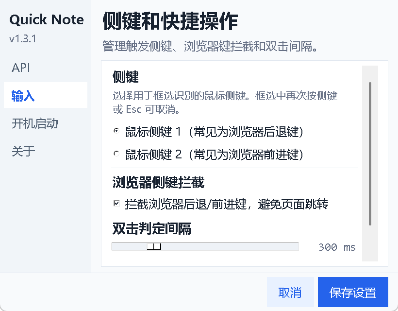

# Quick Side Note

Quick Side Note 是一个面向 Windows 的轻量侧键便签工具。它可以用鼠标侧键框选屏幕英文文本，通过 Windows OCR 识别，再调用 DeepSeek 文本接口翻译，并把结果写入便签和生词本。




## 功能

- 鼠标侧键 1 或侧键 2 触发屏幕框选。
- Windows OCR 本地识别英文文本。
- DeepSeek API 翻译为简体中文。
- 多页便签，每页保存为独立 txt 文件。
- 生词本保存为 `vocabulary.jsonl`。
- 设置界面采用左侧导航和滚动内容区，支持 API Key、开机启动、侧键选择、浏览器键拦截和双击间隔。
- 程序启动后显示 Windows 通知区域托盘图标，支持双击显示/隐藏和右键菜单操作。
- Inno Setup 安装器，支持开始菜单、可选桌面快捷方式和卸载入口。

## 下载

请在 GitHub Releases 下载最新版：

- `QuickSideNote_Setup_v1.4.2.exe`：推荐安装器。
- `QuickSideNote_App_v1.4.2.zip`：便携版压缩包。

## 使用

安装后第一次启动时，如果没有检测到 `DEEPSEEK_API_KEY`，应用会打开首次运行设置窗口。

常用操作：

- 鼠标侧键单击：进入框选识别和翻译。
- 鼠标侧键双击：显示或隐藏便签窗口。
- 框选中再次按侧键或按 `Esc`：取消框选。
- 右下角通知区域托盘图标：双击显示/隐藏便签，右键菜单可打开设置或退出程序。
- `Ctrl+K`：打开 API 设置。
- `Ctrl+,`：打开完整设置界面。
- `Ctrl+S`：保存当前便签。
- `Ctrl+L`：清空当前页。
- `Ctrl+Q`：退出应用。
- `Alt` + 鼠标左键拖动：移动窗口。

## 数据位置

用户数据保存在：

```text
%USERPROFILE%\Documents\QuickSideNote
```

主要文件：

- `note.txt`：第 1 页便签。
- `note-2.txt`、`note-3.txt`：后续便签页。
- `vocabulary.jsonl`：生词和翻译记录。
- `state.json`：窗口位置、当前页和设置。
- `quick_note.log`：运行日志。

卸载程序不会主动删除这些用户数据。

## 从源码运行

环境：

- Windows 10/11
- Python 3.11+

安装依赖：

```powershell
python -m pip install -r requirements.txt
```

运行：

```powershell
python quick_note.py
```

## 构建安装器

需要先安装 Inno Setup 6。

```powershell
winget install --id JRSoftware.InnoSetup -e
```

构建：

```cmd
.\scripts\build_installer.cmd
```

输出：

```text
release\QuickSideNote_App_v1.4.2
release\QuickSideNote_Setup_v1.4.2.exe
```

## 测试

```powershell
python -m py_compile quick_note.py
python -m unittest tests.test_quick_note_core
```

## 隐私说明

- 截图只用于临时 OCR 识别，处理后会删除临时截图文件。
- 默认优先使用 Windows OCR 在本机识别文字。
- 翻译时会把识别出的文本发送给 DeepSeek API。
- API Key 保存到当前 Windows 用户环境变量 `DEEPSEEK_API_KEY`。

## 许可

This project is licensed under the MIT License. See [LICENSE](LICENSE) for details.
