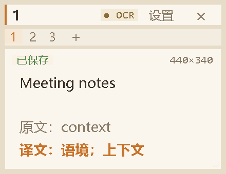
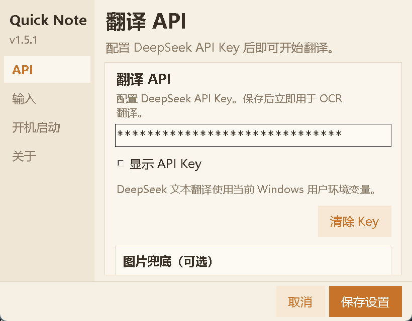
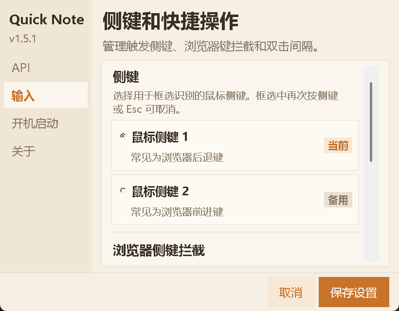

# Quick Side Note v1.5.2 UI 与交互优化方案

文档状态：已实施并完成源码、截图和单元测试验证<br>
基线版本：v1.5.1<br>
目标版本：v1.5.2<br>
制定日期：2026-07-10<br>
审查模型：`gpt-5.6-sol`<br>
实施原则：保留现有 Tkinter、Win32 钩子、OCR 和托盘架构，优先修复可用性问题，不在补丁版本中重写框架。

## 实施记录

2026-07-10 已完成本方案列出的 v1.5.2 范围：主窗口底部栏固定、所有设置页滚动和工作区适配、OCR/翻译状态 HUD、侧键与 Esc 取消、失败恢复、清空撤销、侧键响应模式、API 连接测试与清除确认、页签更多菜单、键盘焦点与暖色主题对比度调整。已通过 59 项单元测试，并在隔离 Tkinter 预览实例中验证主窗口、API 页、输入页和翻译 HUD 截图。

## 0. 结论

v1.5.1 的暖色纸张视觉方向已经成立，界面层级也比早期版本清晰，但当前仍有四项会直接影响正常使用的高优先级问题：

1. 主窗口底部操作栏在默认尺寸下不可见。
2. API 设置页的“图片兜底”控件被裁切，用户无法完整查看或操作。
3. 框选结束后，OCR 和翻译阶段缺少持续可见的状态、取消入口和失败恢复。
4. 清空便签会立即保存，没有确认或撤销机制。

因此，v1.5.2 应定位为“界面可用性与交互闭环修复版”，不新增 Studio、思维导图、报告等大功能。先把现有核心流程做完整，再扩展内容整理能力。

## 1. 审查结果

| 维度 | 得分 | 主要结论 |
| --- | ---: | --- |
| 视觉设计 | 7.4 / 10 | 风格统一，但部分文字对比度不足，状态表达不够明确。 |
| 交互体验 | 5.2 / 10 | 核心功能可用，但翻译过程、破坏性操作和侧键判定缺少完整反馈。 |
| 无障碍与适配 | 4.6 / 10 | 键盘焦点、控件语义、高 DPI 和小屏适配需要补齐。 |
| 综合 | 5.8 / 10 | 可以继续沿用当前设计，但需先完成 P1 可用性修复。 |

### 1.1 主窗口证据



当前截图中，编辑区占满了可用高度，底部“保存、清空、隐藏、设置”操作栏没有显示。即使增加窗口高度，现有布局顺序仍可能使操作栏被编辑区挤出。

### 1.2 API 设置页证据



API 页面没有滚动容器，固定高度下“图片兜底（可选）”区域只显示标题，具体开关和说明无法访问。

### 1.3 输入设置页证据



输入设置页已经使用滚动内容区，可作为 API、开机启动和关于页面的统一实现参考。

## 2. 目标与边界

### 2.1 v1.5.2 目标

- 默认窗口尺寸下，所有主要操作均可见或可通过明确入口访问。
- 从按下侧键到 OCR、翻译、成功、失败或取消，每个阶段都有可理解的反馈。
- 清空便签、清除 API Key 等破坏性操作可以确认或撤销。
- 设置窗口在常见屏幕尺寸、缩放比例和多显示器环境下不会裁切内容。
- 主要功能可以仅使用键盘完成，焦点状态清晰。
- 正文、辅助文字和状态文字达到可读的颜色对比度。
- 不改变现有用户数据目录、便签格式、API 配置方式和安装升级路径。

### 2.2 本版本不做

- 不迁移到 Qt、WebView、Electron 或其他 UI 框架。
- 不重写 OCR、翻译服务和全局钩子的核心实现。
- 不引入账号系统、云同步或新的内容生成服务。
- 不在本版本加入思维导图、报告、信息图、测试等 Studio 功能。
- 不大幅改变 v1.5 的暖色纸张视觉风格。

## 3. 优先级总表

| 编号 | 优先级 | 优化项 | 预期结果 |
| --- | --- | --- | --- |
| UI-01 | P1 | 修复主窗口底部操作栏 | 默认和最小可用尺寸下始终可见。 |
| UI-02 | P1 | 设置页滚动与工作区适配 | 所有设置项均可访问，不超出屏幕。 |
| UX-01 | P1 | OCR/翻译状态浮层与恢复 | 任务全程可见、可取消、失败可返回。 |
| UX-02 | P1 | 清空便签撤销 | 防止误操作造成内容丢失。 |
| UX-03 | P2 | 侧键单击/双击判定优化 | 降低框选启动延迟，避免语义冲突。 |
| UX-04 | P2 | API 状态与清除流程 | 配置是否可用一目了然。 |
| UI-03 | P2 | 页签溢出与重命名入口 | 多页和长名称场景保持可操作。 |
| COPY-01 | P2 | 侧键拦截文案修正 | 设置说明与真实行为一致。 |
| A11Y-01 | P2 | 对比度与状态语义 | 正文与状态达到 WCAG AA 常规文字标准。 |
| A11Y-02 | P2 | 键盘焦点与工具提示 | 主要操作支持 Tab、Enter、Space 和方向键。 |
| QA-01 | P2 | DPI、多屏和极限状态回归 | 100%、125%、150% 缩放下无裁切和重叠。 |

## 4. 详细优化方案

### 4.1 UI-01：主窗口布局重排

**现状**

主窗口在构建编辑器后再放置底部操作栏，编辑器使用扩展填充，导致操作栏在部分尺寸下被挤出。现有最小尺寸也没有覆盖完整工具栏所需空间。

**实施方案**

- 将主窗口内容改为稳定的三段布局：顶部页签、中央编辑区、底部操作栏。
- 推荐使用 `grid` 管理主区域：编辑区所在行权重为 1，顶部和底部行保持内容高度。
- 如果继续使用 `pack`，必须先固定顶部和底部，再让编辑区填充剩余空间。
- 底部操作栏保持单行；宽度不足时优先隐藏快捷键提示，不隐藏主要按钮。
- 将窗口最小尺寸调整为能够完整容纳页签、两行正文和操作栏的尺寸，建议从 `380 x 300` 起进行实机校准。
- 编辑区可选增加细窄滚动条，长文本不依赖鼠标滚轮的隐式行为。

**验收标准**

- 在默认尺寸、最小尺寸和 `440 x 500` 下，底部操作栏均完整可见。
- 缩放窗口时，只有编辑区高度变化，顶部页签和底部操作栏不跳动。
- 宽度不足时，按钮文字不截断，快捷键提示按规则折叠。
- 保存状态变化不会引发布局位移。

### 4.2 UI-02：设置窗口滚动与屏幕适配

**现状**

设置窗口固定为 `820 x 640` 且不可调整。输入页已使用滚动容器，但 API、开机启动和关于页面没有统一使用，导致 API 页下方控件被裁切。

**实施方案**

- 所有设置页统一使用同一套可滚动页面容器。
- 左侧导航固定，右侧内容区独立滚动，底部“取消/保存设置”固定不动。
- 设置窗口允许调整大小，并设置合理最小尺寸。
- 打开窗口时读取当前显示器工作区，窗口宽高不得超过工作区的 90%。
- 在小屏或高缩放场景下自动缩小初始尺寸，不把窗口定位到任务栏或屏幕外。
- 切换设置页后保持该页面的滚动位置；首次进入页面时回到顶部。

**验收标准**

- API 页的图片兜底开关、说明文字和保存按钮在 `1366 x 768 / 150%` 下可访问。
- 所有页面均可通过鼠标滚轮、触控板、Page Up/Page Down 和滚动条浏览。
- 窗口从主屏移动到不同缩放比例的副屏后，不出现控件重叠或窗口超出工作区。
- 底部操作按钮在滚动过程中始终可见。

### 4.3 UX-01：OCR 与翻译任务状态闭环

**现状**

侧键单击需要等待双击判定，应用随后隐藏并进入框选。框选结束后，OCR 和翻译最长可等待约 30 秒，但状态仅存在于已隐藏的主窗口内。取消或失败只短暂提示，用户容易误以为程序卡住或退出。

**推荐状态流程**

```text
就绪
  -> 准备框选
  -> 框选中
  -> 正在识别
  -> 正在翻译
  -> 已完成
  -> 返回就绪

任意任务状态
  -> 用户取消 / 超时 / 失败
  -> 显示原因与“重试”“返回便签”
  -> 恢复任务开始前的窗口可见状态
```

**实施方案**

- 增加轻量、置顶、不可抢占输入焦点的任务 HUD，显示在光标附近或任务栏上方。
- HUD 使用明确状态文字：`准备框选`、`框选中`、`正在识别`、`正在翻译`。
- 识别和翻译阶段提供可点击的取消按钮；侧键和 `Esc` 继续作为快捷取消入口。
- 记录任务开始前主窗口是否可见。取消、失败或超时后恢复原状态，不让便签保持无提示隐藏。
- 失败状态至少保留到用户处理，提供“重试”和“返回便签”，不只显示 1.8 秒提示。
- 成功后 HUD 显示短暂完成状态，再按用户原有工作流显示便签结果。
- 主窗口现有 `OCR` 状态改为真实状态文本，例如“就绪”“识别中”“翻译中”，避免看起来像按钮。

**状态与操作约定**

| 状态 | 可见反馈 | 侧键 | Esc | 超时处理 |
| --- | --- | --- | --- | --- |
| 准备框选 | HUD 提示 | 取消 | 取消 | 自动返回就绪 |
| 框选中 | 选区遮罩和说明 | 取消 | 取消 | 不适用 |
| 正在识别 | HUD 进度状态 | 取消 | 取消 | 显示本地 OCR 超时原因 |
| 正在翻译 | HUD 进度状态 | 取消 | 取消 | 显示网络或服务超时原因 |
| 失败 | 原因、重试、返回 | 关闭提示 | 返回 | 保持到用户操作 |

**验收标准**

- 从首次按下侧键开始，任何等待超过 150 ms 的阶段都有可见反馈。
- 框选、识别、翻译阶段均可通过 HUD、侧键或 `Esc` 取消。
- 取消或失败后不会追加过期结果，也不会让主窗口永久隐藏。
- 网络断开、API Key 无效、请求超时和程序退出场景均不会遗留 HUD 或后台任务回调错误。

### 4.4 UX-02：清空便签支持撤销

**现状**

“清空”会立即删除当前页内容并保存，误触后没有直接恢复入口。

**推荐方案**

- 点击清空后先保留当前文本快照，编辑区立即清空。
- 底部显示持续 8 秒的操作提示：`已清空当前页  撤销`。
- 用户点击撤销或按 `Ctrl+Z` 时恢复快照和光标位置。
- 撤销窗口结束后再将清空结果作为最终状态保存；程序在此期间退出时，仍通过原子保存和备份保证可恢复。
- 空白页面点击清空时不执行任何写入，只提供轻微状态反馈。

与确认弹窗相比，撤销提示不会打断高频记录流程，更适合便签工具。

**验收标准**

- 清空后 8 秒内可以完整恢复文字、选区或光标位置。
- 切换页面、关闭窗口或退出程序时，待处理状态有明确且一致的保存策略。
- 连续清空不同页面不会覆盖错误页面的撤销快照。

### 4.5 UX-03：侧键交互与延迟

**现状**

同一个侧键承担三种行为：单击框选、双击显示/隐藏、任务中再次按下取消。为了等待双击，单击框选存在约 300 至 360 ms 的固定延迟。

**v1.5.2 兼容方案**

- 默认保留现有单击和双击语义，避免补丁版本改变老用户习惯。
- 第一次按下后立即显示“准备框选”反馈，消除无响应感。
- 在设置中增加“侧键响应模式”：
  - `兼容模式`：单击框选，双击显示/隐藏。
  - `即时框选`：单击立即框选；显示/隐藏改用托盘或固定快捷键。
- 设置页说明每种模式的延迟和行为，不让用户猜测。

**后续方向**

v1.6 可考虑移除侧键双击显示/隐藏，将窗口切换统一放到托盘、全局快捷键或另一个侧键，从根本上消除延迟。

**验收标准**

- 兼容模式第一次按下后 150 ms 内出现准备反馈。
- 即时框选模式不等待双击判定。
- 任务中的取消行为优先级最高，不会触发显示/隐藏。
- 浏览器前进/后退键是否被拦截与设置说明一致。

### 4.6 COPY-01：修正侧键拦截文案

**现状**

当前“拦截对应的浏览器后退/前进键”文案容易让用户认为关闭后选中的物理侧键不会被程序占用，但实际选中的 XBUTTON 仍需被应用捕获，该开关只控制额外的浏览器虚拟键处理。

**实施方案**

- 将开关名称改为：`同时拦截浏览器后退/前进快捷键`。
- 增加说明：`选中的鼠标侧键始终由 Quick Side Note 使用；此选项仅控制浏览器虚拟键。`
- 如果关闭后仍存在浏览器跳转，应显示诊断提示或记录可识别的日志，而不是静默失败。

### 4.7 UX-04：API 状态与危险操作

**实施方案**

- API Key 卡片显示状态徽标：`未配置`、`已保存`、`验证中`、`可用`、`验证失败`。
- 增加“测试连接”按钮，只发送最小验证请求，不写入便签。
- 验证失败时区分无 Key、鉴权失败、网络失败、超时和服务端错误。
- “清除 API Key”使用危险操作样式，并改为“清除并保存”。
- 执行前显示确认，说明清除后翻译不可用但本地便签不会删除。
- API Key 输入框的显示/隐藏使用眼睛图标按钮，并提供工具提示和键盘焦点。

**验收标准**

- 用户不需要发起一次真实翻译就能判断 API 配置是否可用。
- 点击取消不会意外保存新 Key；点击“清除并保存”后状态立即同步。
- 界面和日志均不显示完整 API Key。

### 4.8 UI-03：页签溢出与重命名

**实施方案**

- 为页签设置最大显示宽度，超长标题使用省略号，工具提示显示完整名称。
- 页签区域增加横向滚动或“更多”菜单，保证新增按钮始终可见。
- 支持右键菜单中的“重命名”“清空”“删除”；高风险操作需要确认或撤销。
- 增加 `F2` 重命名当前页，保留双击重命名作为兼容入口。
- 当前页使用背景、字重和底部指示线共同表达，不只依赖颜色。

**验收标准**

- 3、6、10 个页签以及 20 个汉字的页名下，新增页和当前页始终可访问。
- 鼠标、键盘和右键菜单都能发现重命名入口。
- 页签滚动不会改变正文焦点或误触页面切换。

### 4.9 A11Y-01：颜色与状态表达

当前部分常规文字颜色未达到 4.5:1 的建议对比度：

| 当前组合 | 对比度 | 结论 |
| --- | ---: | --- |
| `#8a7a66` / `#faf6ee` | 3.85:1 | 辅助文字偏浅。 |
| `#c8732a` / `#faf6ee` | 3.28:1 | 强调文字偏浅。 |
| `#a89880` / `#faf6ee` | 2.61:1 | 快捷键提示明显不足。 |
| `#5a8a4e` / `#fbf2e6` | 3.66:1 | 成功状态偏浅。 |

建议候选颜色：

| 用途 | 候选颜色 | 背景 | 对比度 |
| --- | --- | --- | ---: |
| 次要文字 | `#6f604e` | `#faf6ee` | 5.63:1 |
| 强调文字 | `#9b4f16` | `#faf6ee` | 5.53:1 |
| 快捷键提示 | `#6b5b49` | `#faf6ee` | 6.05:1 |
| 成功状态 | `#35662f` | `#fbf2e6` | 6.13:1 |

最终颜色需在 100%、125%、150% 缩放和普通办公显示器上实测。状态不能只依赖红、绿颜色，还要同时使用文字或图标。

### 4.10 A11Y-02：键盘、焦点与控件语义

**实施方案**

- 将承担点击行为的文本标签替换为真实按钮、单选按钮或设置 `takefocus` 的自定义控件。
- 所有主要按钮支持 `Enter` 和 `Space`，设置导航支持上/下方向键。
- 页签支持左/右方向键，`Ctrl+Tab` 切换页面，`F2` 重命名。
- 提供清晰的焦点边框，暖色主题下仍有足够对比度。
- 为仅图标按钮增加工具提示和无歧义名称。
- 托盘菜单文案如果标注 Enter，则主窗口必须绑定 `Return`；否则删除错误提示。
- 标题栏的 `×` 当前表示隐藏而不是退出，应改用隐藏语义图标或工具提示明确说明。

**验收标准**

- 不使用鼠标即可完成切换页面、编辑、保存、打开设置、修改设置和取消任务。
- 焦点不会进入不可见控件，也不会在滚动页面中丢失。
- 屏幕阅读器可读取主要控件名称属于后续增强项，但本版本不能继续使用无法聚焦的纯文本伪按钮。

## 5. 实施阶段

### 阶段一：P1 布局与任务反馈

- 完成 UI-01 主窗口底部操作栏。
- 完成 UI-02 设置页统一滚动与工作区限制。
- 完成 UX-01 任务 HUD、取消、超时和可见状态恢复。
- 补充对应单元测试和手工截图基线。

### 阶段二：数据安全与配置闭环

- 完成 UX-02 清空撤销。
- 完成 UX-04 API 状态、测试连接和清除确认。
- 验证原子保存、自动保存和撤销状态不会互相覆盖。

### 阶段三：高频交互优化

- 完成 UX-03 侧键响应模式。
- 完成 COPY-01 文案修正。
- 完成 UI-03 页签溢出、重命名和更多菜单。

### 阶段四：无障碍与回归

- 完成 A11Y-01、A11Y-02。
- 执行 DPI、多屏、键盘和故障场景测试。
- 更新 README、CHANGELOG、设置说明和发布截图。

## 6. 测试矩阵

### 6.1 窗口与显示

| 项目 | 覆盖范围 |
| --- | --- |
| Windows 缩放 | 100%、125%、150% |
| 分辨率 | 1366 x 768、1920 x 1080、2560 x 1440 |
| 多显示器 | 主屏/副屏、不同缩放、负坐标显示器 |
| 主窗口 | 默认、最小、最大、窄宽、高窗口 |
| 设置窗口 | 每个页面顶部、底部、切页后滚动位置 |

### 6.2 内容边界

- 空便签、单行、长文、超长单词和中英文混排。
- 3、6、10 个页签以及超长页签名。
- 空 API Key、错误 Key、有效 Key、网络断开和请求超时。
- 图片兜底关闭、开启、服务不可用和用户取消。

### 6.3 输入与状态

- 鼠标侧键 1、侧键 2、兼容模式和即时框选模式。
- 单击、双击、任务中再次按键、连续快速按键。
- 框选取消、OCR 失败、翻译取消、翻译超时、翻译成功。
- 仅键盘操作和主窗口失去焦点后的快捷键行为。
- 托盘双击、右键菜单、资源管理器重启后托盘恢复。

### 6.4 自动化测试建议

- 主窗口布局计算和最小尺寸约束。
- 任务状态机的合法转换、取消代次和过期结果丢弃。
- 清空撤销的页面隔离、延迟保存和退出处理。
- 设置窗口工作区尺寸计算、负坐标和 DPI 输入。
- 页签标题截断、溢出菜单和当前页保持。
- API 状态映射不泄露 Key 或响应敏感信息。

## 7. 发布验收门槛

v1.5.2 只有满足以下条件才能打包发布：

- P1 项全部完成且没有已知阻断问题。
- 默认主窗口和所有设置页均无裁切、重叠、文字溢出。
- OCR/翻译成功、失败、取消、超时四条流程均有完整可见反馈。
- 清空当前页可以撤销，API Key 清除需要明确确认。
- 现有单元测试全部通过，并新增本方案关键状态测试。
- 完成 100%、125%、150% 缩放的真实 Windows 截图验证。
- 安装版覆盖升级不会改变便签、词汇本和 API 配置数据。
- README、CHANGELOG、中文首次配置说明与实际界面一致。

## 8. 建议版本拆分

### v1.5.2 必须完成

- 主窗口底部操作栏修复。
- 设置页滚动和工作区适配。
- OCR/翻译任务 HUD、取消和失败恢复。
- 清空便签撤销。
- API Key 清除确认。
- 基础对比度和键盘焦点修复。

### v1.5.3 可继续完善

- 即时框选模式和侧键手势进一步简化。
- 页签更多菜单、右键菜单和完整键盘导航。
- API 测试连接的诊断细节。
- 更完整的多显示器 DPI 适配。

### v1.6 再评估

- UI 框架是否需要迁移。
- Studio、思维导图、报告、信息图和测试功能。
- 凭据从用户环境变量迁移到 Windows Credential Manager。
- OCR/翻译任务队列和可扩展服务接口。

## 9. Definition of Done

每个优化项必须同时满足：代码实现、自动化测试、真实 Windows 手工验证、截图对比、文档更新五项要求。仅修改视觉样式但没有修复状态反馈、取消路径和数据恢复，不视为完成。

本文档是 v1.5.2 的实施基线；上述界面、交互、测试、截图和打包验证均已按本方案完成。
